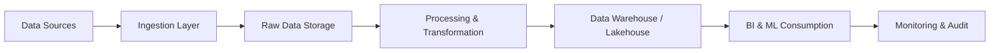

Here is the **detailed Student Manual** for the module:

## 📘 **Data Engineering Overview – Student Manual**


---

### 🎯 **Module Objective**

Equip learners with a solid understanding of **Data Engineering fundamentals**, **industry roles**, **real-world applications**, and the **end-to-end lifecycle** of data in modern organizations.

---

## 📍 Section 1: What is Data Engineering?

### ✅ Definition:

Data Engineering is the field focused on building **systems and infrastructure** that collect, store, process, and make data available for analytics and decision-making.

### ✅ Purpose:

* **Make data available, usable, and secure**
* Support **data scientists, analysts, and ML workflows**
* Enable **real-time and batch decision-making**

---

## 📍 Section 2: Core Responsibilities of a Data Engineer

| Responsibility            | Description                                          | Tools Used                                   |
| ------------------------- | ---------------------------------------------------- | -------------------------------------------- |
| **Ingestion**             | Extract data from APIs, databases, IoT devices, logs | Apache NiFi, Pub/Sub, Kafka, Cloud Dataflow  |
| **Storage**               | Choose the right storage (SQL/NoSQL/File/Object)     | Cloud Storage, BigQuery, Firestore, Bigtable |
| **Processing**            | Apply transformations, validations, enrichments      | Apache Spark, Dataflow, Beam                 |
| **Orchestration**         | Automate and schedule workflows                      | Apache Airflow, Cloud Composer               |
| **Monitoring**            | Monitor pipeline health and errors                   | Stackdriver, Prometheus, Grafana             |
| **Governance & Security** | Apply encryption, access controls, auditing          | IAM, VPC-SC, DLP APIs, Data Catalog          |

---

## 📍 Section 3: Role of a Data Engineer in the Data Ecosystem

| Role                 | Interaction                                    | Value                         |
| -------------------- | ---------------------------------------------- | ----------------------------- |
| With Data Scientists | Provide clean, formatted data for models       | Accelerates ML pipeline       |
| With Analysts        | Deliver aggregated and real-time data          | Enables faster insights       |
| With DevOps          | Ensure deployment, scaling, CI/CD of pipelines | Automates data release cycles |
| With Business        | Provide trusted and timely data                | Informs strategic decisions   |

---

## 📍 Section 4: Data Engineering Lifecycle



---

## 📍 Section 5: Real-Life Use Cases

### ✅ **Use Case 1: Customer Behavior Analytics (Retail)**

* **Source**: Website Clickstream + Purchase History
* **Pipeline**: Kafka → Dataflow → BigQuery
* **Outcome**: Real-time dashboard of customer segmentation and conversion funnel.

### ✅ **Use Case 2: Fraud Detection (Banking)**

* **Source**: Transaction Logs
* **Pipeline**: Kinesis → Flink → S3 → EMR
* **Outcome**: Trigger fraud alerts within milliseconds.

### ✅ **Use Case 3: IoT-based Farming**

* **Source**: Soil Sensors, Drone Feeds
* **Pipeline**: MQTT → Pub/Sub → BigQuery
* **Outcome**: Optimize irrigation and pesticide usage.

---

## 📍 Section 6: Common Technologies in GCP for Data Engineers

| Category      | Service                                        | Description                                 |
| ------------- | ---------------------------------------------- | ------------------------------------------- |
| Compute       | **Dataflow**, **Cloud Functions**              | Stream/Bulk processing                      |
| Storage       | **Cloud Storage**, **BigQuery**, **Firestore** | Object, warehouse, NoSQL                    |
| Messaging     | **Pub/Sub**                                    | Serverless messaging and event distribution |
| Orchestration | **Cloud Composer (Airflow)**                   | DAG-based workflow automation               |
| Monitoring    | **Stackdriver**, **Cloud Logging**             | Alerting, dashboards                        |

---

## 📍 Section 7: Hands-On Activities (Suggested)

| Lab Task                                  | Tools Involved     | Outcome                     |
| ----------------------------------------- | ------------------ | --------------------------- |
| 1. Setup GCP Project & IAM Roles          | GCP Console, IAM   | Secured project setup       |
| 2. Create a Storage Bucket & Upload Files | Cloud Storage      | Understand storage classes  |
| 3. Ingest CSV Data to BigQuery            | BQ Console or CLI  | Explore data structure      |
| 4. Write a Dataflow Pipeline              | Apache Beam on GCP | Basic ETL transformation    |
| 5. Schedule Workflow in Cloud Composer    | Airflow DAG        | Full pipeline orchestration |

---

## 📍 Section 8: Day-in-the-Life of a Data Engineer

### 🔄 Daily Tasks:

* Monitor pipeline dashboards
* Fix failed DAGs
* Add new data sources
* Improve pipeline performance
* Collaborate with data teams

---

## 📍 Section 9: Industry Examples (Detailed)

### 🛍 Walmart – **Retail Analytics at Scale**

* **Challenge**: Track real-time purchases, returns, inventory
* **Solution**: Kafka + Flink + S3 + Redshift
* **Impact**: 360° visibility and operational savings

### 🎬 Netflix – **Recommendation Engine**

* **Challenge**: Deliver personalized content in real-time
* **Solution**: Spark + Dataflow + Iceberg + Presto
* **Impact**: Improved engagement and retention

### 🏥 Mayo Clinic – **Medical Data Integration**

* **Challenge**: Merge EMR, wearable, lab data securely
* **Solution**: Dataflow + Firestore + Looker
* **Impact**: Precision medicine and faster diagnosis

---

## 📍 Section 10: Key Takeaways

* Data Engineers are the backbone of data-driven organizations
* They enable accurate, real-time decision-making
* GCP offers powerful, scalable, and serverless tools
* Focus on building **resilient, secure, and efficient pipelines**

---

## 📍 Section 11: Quiz / Knowledge Check (Sample)

1. What's the difference between Dataflow and BigQuery?
2. What is schema drift? How do you handle it?
3. What is the purpose of Pub/Sub?
4. Describe a DAG in orchestration tools like Airflow.
5. Real-world scenario: You receive unstructured JSON via API every hour — what GCP services would you use to process and store it?

---

## 📍 Section 12: Visual Summary (One Pager)

```plaintext
🏗️ Ingest → Transform → Store → Serve → Monitor
       ↓         ↓         ↓         ↓        ↓
  Pub/Sub → Dataflow → BigQuery → Looker → Stackdriver
```

---
